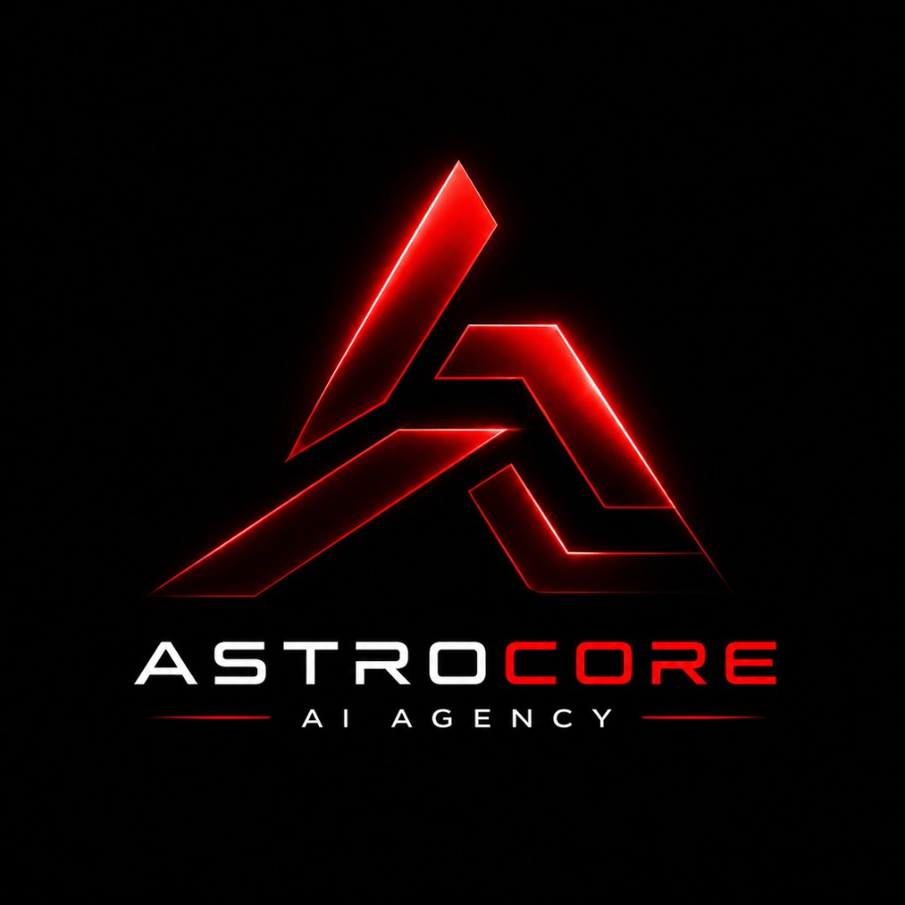
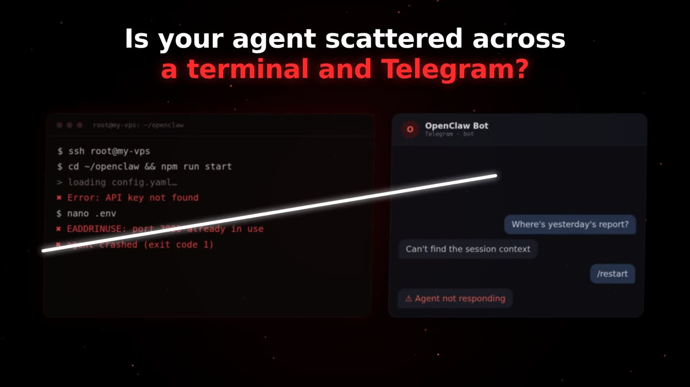

<p align="center">
  
</p>

<h1 align="center">AstroCore AI</h1>

<p align="center">
  <b>Your OpenClaw agent's home in the browser.</b><br/>
  Chat, memory, files, reports and scheduled missions, in one place and with no terminal.
</p>

<p align="center">
  <a href="https://astrocore.one">Website</a> ·
  <a href="https://astrocore.one/register">Start free</a> ·
  <a href="https://astrocore.one/guides">Guides</a> ·
  <a href="https://discord.gg/aQevqZxPqc">Discord</a> ·
  <a href="https://clawhub.ai/dimasash2005-ship-it/skills/astrocore">OpenClaw skill</a>
</p>

<p align="center">
  
</p>

---

## What is AstroCore?

You already run an [OpenClaw](https://openclaw.ai) agent, but it lives in a terminal or a Telegram bot.
AstroCore gives it a proper web workspace: you talk to it in a normal chat, it remembers context,
and it saves finished work as clean reports you can read, export and share.

AstroCore is **not** an AI model and not another agent. It is the environment around the agent you already have.

## Features

- **Connect in about a minute.** Go to Providers → Connect OpenClaw agent, run one command on your server, done.
- **Chat:** text, voice and photos, in the browser instead of SSH or Telegram.
- **Memory:** the agent keeps context across sessions and restarts.
- **Reports:** results are saved with text, key figures, charts and sources.
- **Missions:** give the agent a task once and it runs it once, daily or weekly. Each result lands in Reports automatically.
- **Public reports:** share any report as a clean public page with one link. Chats, memory and other reports stay private.
- **Files and gallery** for documents and generated images.
- **Other providers:** Claude, OpenAI, Gemini or any OpenAI-compatible API can be added as well.

## How it works

```
OpenClaw agent (your server)  ──►  AstroCore connector  ──►  astrocore.one
         ▲                                                        │
         └──────── tasks from chat and missions ◄─────────────────┘
```

1. **Connect** your OpenClaw agent from the Providers page.
2. **Work** with it in chat, or create a mission that runs on schedule.
3. **Get reports** with sources and charts, and share them if you want.

Your agent keeps running on your own server. AstroCore only sends it tasks and stores the results in your account.

## Tech stack

- [Next.js](https://nextjs.org) (App Router) + TypeScript
- [Supabase](https://supabase.com): auth, Postgres with row-level security, storage, cron
- Hosted on [Vercel](https://vercel.com)

## Running locally

```bash
git clone https://github.com/dimasash2005-ship-it/astrocore.git
cd astrocore
npm install
```

Create `.env.local` with your own Supabase project values:

```env
NEXT_PUBLIC_SUPABASE_URL=...
NEXT_PUBLIC_SUPABASE_ANON_KEY=...
SUPABASE_SERVICE_ROLE_KEY=...
CRON_SECRET=...
```

Then start the dev server:

```bash
npm run dev
```

> Never commit `.env.local` or real API keys.

## Status

AstroCore is in **open beta** and free to use. You pay your AI providers directly.
Built in Ukraine 🇺🇦

## Contact

- Email: astrocore.one@outlook.cz
- Discord: [join the community](https://discord.gg/aQevqZxPqc)
- Telegram: [@AstroCore_Manager](https://t.me/AstroCore_Manager)